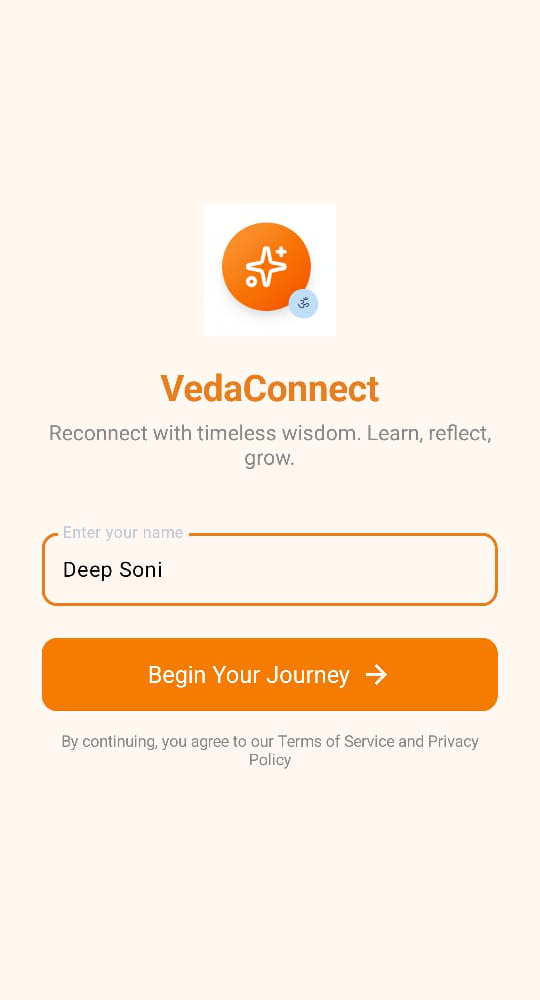
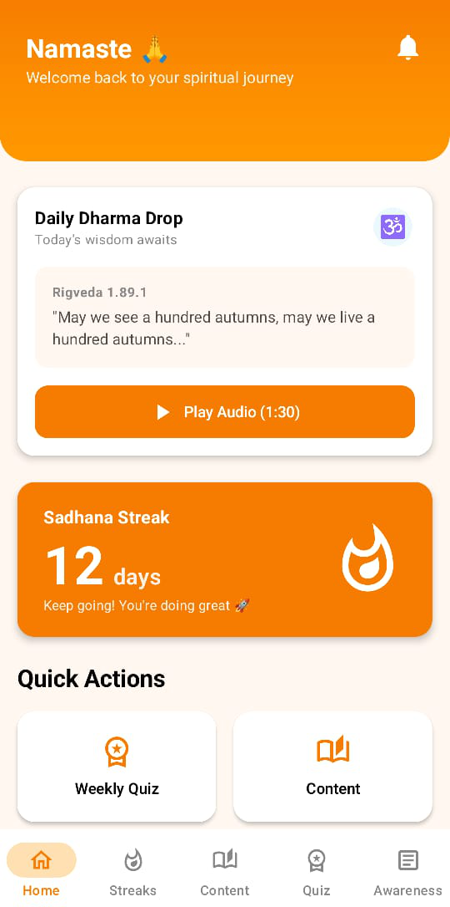
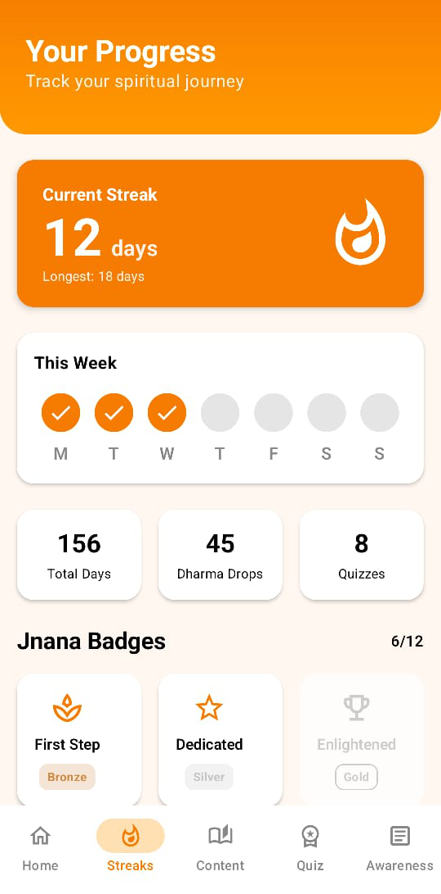
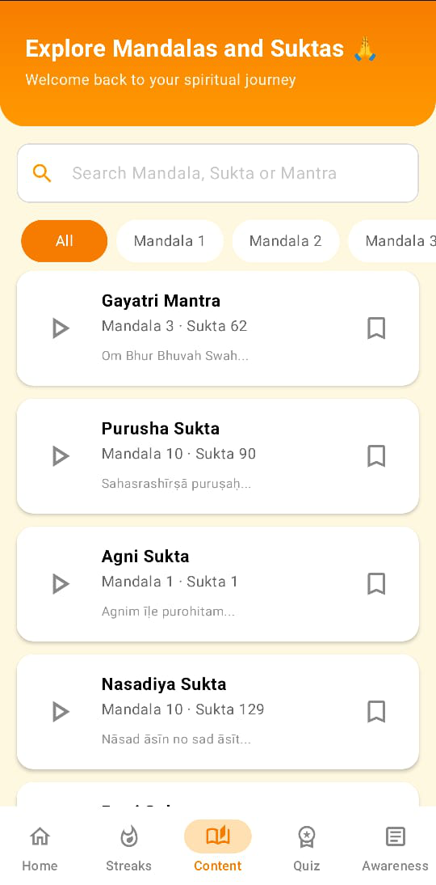
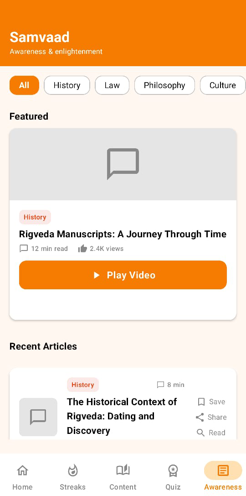
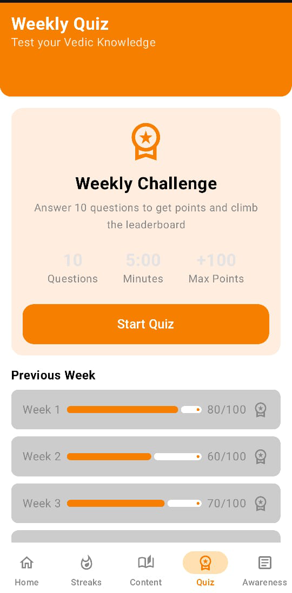

# 🌿 VedaConnect – Rigveda Learning & Engagement App

### *Version 1.0 | October 2025*

> "Empowering modern minds with timeless wisdom."

VedaConnect is a modern, engaging, and habit-forming platform that reconnects individuals with the **timeless wisdom of the Rigveda**, transforming daily learning into a mindful, gamified, and community-driven experience.

---

## ✨ Vision

To empower users with **Knowledge + Awareness**, enabling them to lead more purposeful lives guided by ancient principles and an informed understanding of contemporary issues.

---

## 🚩 The Problem

* **Inaccessibility of Ancient Knowledge** — Vedic wisdom is profound but often hard to access and apply in daily life.
* **Cultural Disconnect** — Many young people feel detached from their heritage and identity.
* **Rise of Uninformed Extremism** — Lack of understanding of Dharma’s true essence leads to rigid beliefs.
* **Lack of Critical Awareness** — Few platforms balance spirituality with rational discussion on societal issues.

---

## 💡 The Solution

**VedaConnect** bridges this gap through a mobile-first experience focused on **four pillars**:

1. 📖 **Daily Learning** – Bite-sized Rigveda wisdom through voice and text.
2. 🧘 **Gamified Engagement** – Streaks, rewards, and leaderboards to build habit.
3. 🗣️ **Critical Awareness** – Contextual learning on social and cultural issues.
4. 🤝 **Awareness Section** – Thoughtful conversations and shared learning.

---

## 📱 Core Features

### 🔔 1. Dharma Drop (Daily Mantra Notification)

Receive a 1–2 minute voice note every day with authentic pronunciation, meaning, and real-life application.

### 🔥 2. Sadhana Streak

Track your daily learning streaks and visualize your consistency.

### 🏅 3. Jnana Badges

Earn shareable badges for milestones (7-day streak, quiz rank, etc.).

### 💬 4. Vimarsh Manch (Community Forum)

Two-layer discussion:

* **AI Chatbot** for quick answers.
* **Community Q&A** for deeper dialogue.

### 🧩 5. Saptahik Prashnottari (Weekly Quiz & Leaderboard)

Weekly quiz + leaderboard for healthy community engagement.

### 📰 6. Samvaad (Awareness & Context Section)

Fact-based articles, infographics, and discussions about real-world cultural and philosophical issues.

---

## 🧠 Tech Stack

| Category                 | Technology                                |
| ------------------------ | ----------------------------------------- |
| **Language**             | Kotlin                                    |
| **UI Framework**         | Jetpack Compose + Material 3              |
| **Architecture**         | MVVM + Repository Pattern                 |
| **Build Tools**          | Gradle (KTS)                              |

---

## 🗂️ Project Structure

```
VedaConnect-main/
│
├── app/
│   ├── src/main/java/com/DeepSoni/vedaconnect/
│   │   ├── MainActivity.kt
│   │   ├── AppNavigation.kt
│   │   ├── audio/                 # Mantra audio playback
│   │   ├── data/                  # Data models
│   │   ├── repository/            # MantraRepository & data access
│   │   ├── feature/
│   │   │   ├── home/              # Home screen
│   │   │   ├── quiz/              # Weekly quiz
│   │   │   ├── community/         # Forum section
│   │   │   ├── content/           # Awareness content
│   │   │   ├── streak/            # Streak & badges
│   │   │   ├── notification/      # Mantra notifications
│   │   │   └── welcome/           # Onboarding flow
│   │   └── ui/theme/              # Theme, typography, colors
│   └── res/                       # XML resources, icons, strings
│
├── build.gradle                   # App build configuration
└── README.md
```

---

---

## 📸 App Screenshots
## 📸 App Screenshots

Explore VedaConnect’s beautiful and intuitive interface ✨

<p align="center">
  
  
  
  
  
  
  
</p>


> *Built with Jetpack Compose & Material 3 — blending tradition with modern simplicity.*


## ⚙️ Getting Started

### 1. Clone the Repository

```bash
git clone https://github.com/deep100ni/VedaConnect.git
cd VedaConnect-main
```

### 2. Open in Android Studio

* Use ***Android Studio Narwhal 3 Feature Drop (2025.1.3)**.
* Let Gradle sync automatically.

### 4. Run the App

Select a device/emulator → click **Run ▶️**.

---

## 🧩 Roadmap

* ✅ Core UI & Navigation
* ✅ Daily Mantra System
* 🚧 Community Forum Integration
* 🚧 Quiz & Leaderboard
* 🔜 AI Chatbot (Phase 2)
* 🔜 Awareness Section (Phase 2)

---

## 🔮 Future Enhancements

* Voice-guided meditation & chanting modules
* Regional language support (Sanskrit, Hindi, English)
* Integration with Bharat Knowledge Graph
* User profile analytics & habit tracking dashboard
* Moderated discussion system for verified content

---

> *VedaConnect aims to merge ancient knowledge with digital experience — inspiring awareness, action, and inner growth.*
 
