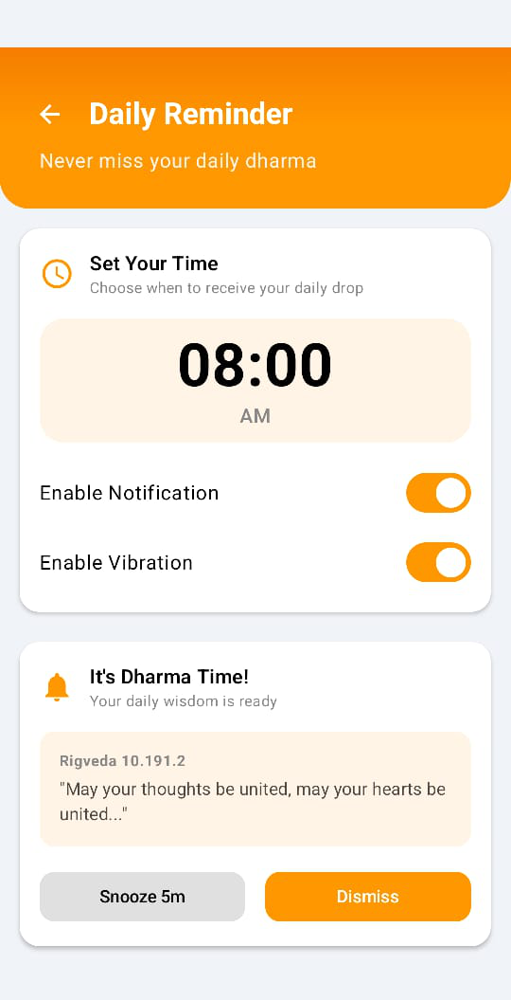
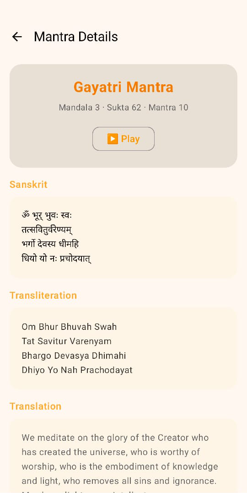

# Under Construction

# 🌿 VedaConnect – Rigveda Learning & Engagement App

### *Hackathon Version 1.0 | October 2025*

> "Empowering modern minds with timeless wisdom."

**VedaConnect** is a modern, engaging, and habit-forming platform that reconnects individuals with the **timeless wisdom of the Rigveda**. This submission showcases the core foundation of an app designed to transform daily learning into a mindful and community-driven experience.

---

## ✨ Vision

To empower users with **Knowledge + Awareness**, enabling them to lead more purposeful lives guided by ancient principles and an informed understanding of contemporary issues.

---

## 🚩 The Problem

*   **Inaccessibility of Ancient Knowledge** — Vedic wisdom is profound but often hard to access and apply in daily life.
*   **Cultural Disconnect** — Many young people feel detached from their heritage and identity.
*   **Rise of Uninformed Extremism** — Lack of understanding of Dharma’s true essence leads to rigid beliefs.
*   **Lack of Critical Awareness** — Few platforms balance spirituality with rational discussion on societal issues.

---

## 💡 The Solution

**VedaConnect** bridges this gap through a mobile-first experience. This hackathon prototype focuses on delivering a seamless user interface and core content experience.

---

## 📱 Core Features (Hackathon Implementation)

### 🔔 1. Daily Dharma Drop
Receive a daily mantra notification to encourage consistent engagement.

### 📖 2. Content Exploration
*   **Mantra Details:** The "Content" screen allows users to explore various mantras.
*   **Audio Playback:** The **Gayatri Mantra** is fully functional with audio playback to demonstrate the intended user experience. Other mantras are included as placeholders for future development.

### 📰 3. Samvaad (Awareness & Context Section)
*   The "Awareness" screen is designed to feature articles and discussions.
*   For this hackathon version, it includes an embedded YouTube video player to showcase the capability of integrating multimedia content.

### 🧩 4. Weekly Quiz
*   The UI for the weekly quiz and leaderboard is complete.
*   The screen displays the results of previous quizzes to illustrate the design and layout. The "Start Quiz" functionality is part of the future development roadmap.

### 🔥 5. Gamification (UI Only)
*   The "Streaks" and "Badges" sections have been designed to show the visual direction of the gamification features. The logic for tracking streaks and awarding badges is planned for a future release.

---

## 🧠 Tech Stack

| Category | Technology |
| :--- | :--- |
| **Language** | Kotlin |
| **UI Framework** | Jetpack Compose + Material 3 |
| **Architecture** | MVVM + Repository Pattern |
| **Build Tools** | Gradle (KTS) |

---

## 🗂️ Project Structure

```
VedaConnect-main/
│
├── app/
│   ├── src/main/java/com/DeepSoni/vedaconnect/
│   │   ├── MainActivity.kt
│   │   ├── AppNavigation.kt
│   │   ├── audio/                 # Mantra audio playback
│   │   ├── data/                  # Data models
│   │   ├── repository/            # MantraRepository & data access
│   │   ├── feature/
│   │   │   ├── home/              # Home screen
│   │   │   ├── quiz/              # Weekly quiz
│   │   │   ├── community/         # Forum section
│   │   │   ├── content/           # Awareness content
│   │   │   ├── streak/            # Streak & badges
│   │   │   ├── notification/      # Mantra notifications
│   │   │   └── welcome/           # Onboarding flow
│   │   └── ui/theme/              # Theme, typography, colors
│   └── res/                       # XML resources, icons, strings
│
├── build.gradle                   # App build configuration
└── README.md
```

---

## 📸 App Screenshots

Explore VedaConnect’s beautiful and intuitive interface ✨

<p align="center">
  
  
  
  
  
  
  
  
</p>

> *Built with Jetpack Compose & Material 3 — blending tradition with modern simplicity.*

## ⚙️ Getting Started

### 1. Clone the Repository

```bash
git clone https://github.com/deep100ni/VedaConnect.git
cd VedaConnect-main
```

### 2. Open in Android Studio

*   Use ***Android Studio Narwhal 3 Feature Drop (2025.1.3)*** or a compatible version.
*   Let Gradle sync automatically.

### 3. Run the App

Select a device/emulator → click **Run ▶️**.

---

## 🧩 Hackathon Roadmap

*   [✅] Core UI & Navigation
*   [✅] Daily Mantra System (UI and Notification)
*   [✅] Content Screen with Functional Audio for Gayatri Mantra(Currently only Gayatri Mantra is functional)
*   [✅] Awareness Section with Video Player(currently video player is work others in future features)
*   [✅] Quiz Screen UI with Previous Results(currently it shows result but don't have any functionality)
*   [🚧] Full Quiz & Leaderboard Functionality
*   [🚧] Gamification Logic (Streaks and Badges)
*   [🚧] Community Forum Integration
*   [🔜] AI Chatbot (Phase 2)

---

## 🔮 Future Enhancements

*   Voice-guided meditation & chanting modules
*   Regional language support (Sanskrit, Hindi, English)
*   Integration with Bharat Knowledge Graph
*   User profile analytics & habit tracking dashboard
*   Moderated discussion system for verified content

---

> *VedaConnect aims to merge ancient knowledge with digital experience — inspiring awareness, action, and inner growth.*